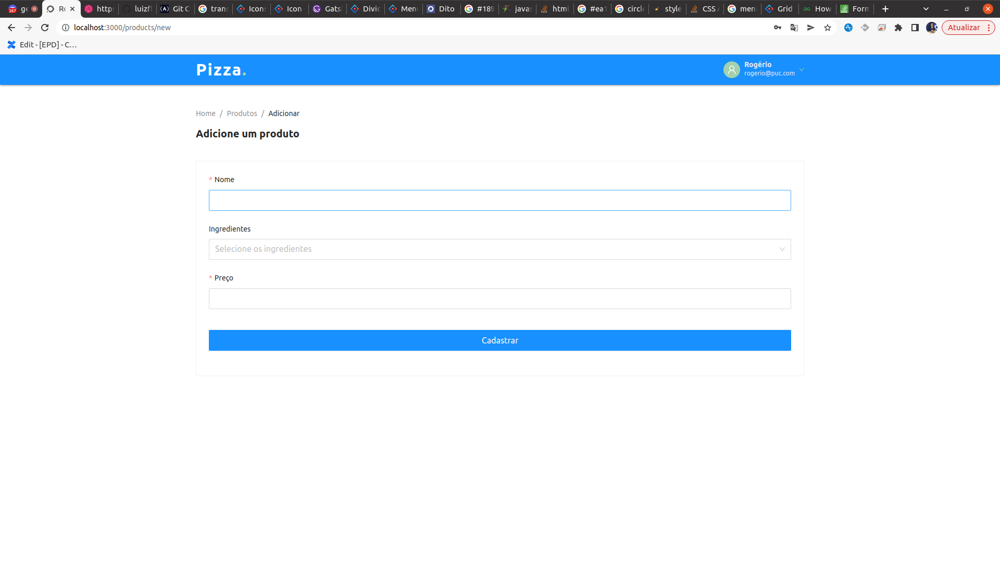

# Documentação

A ata de reunião e as demais definições do trabalho estão contidas em [Google Drive](https://drive.google.com/drive/folders/1vR1Md7HGxVyaCIBAnwARQsuXkKQf2f4S?usp=sharing).

## O Sistema

O sistema consiste em uma aplicação web responsável por fazer o controle dos processos de uma pizzaria física.

## Stack

- Node.js
- ReactJS
- PostgreSQL
- Docker

## Arquitetura

- REST
- Modelo cliente-servidor

## Wireframe

## Home

### Cardápio

### Login

### Produto

### Pedido

